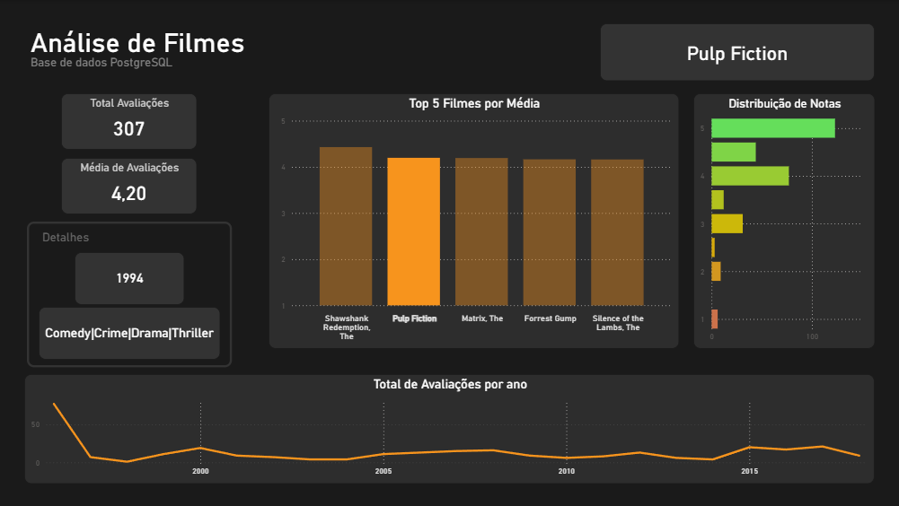

# 🎬 MovieLens Data Warehouse Project

## 📋 Sobre o Projeto
Projeto de Engenharia de Dados fim-a-fim (End-to-End), simulando um ambiente corporativo de Business Intelligence. 
O objetivo foi transformar dados brutos relacionais (CSV) em um Data Warehouse modelado em **Star Schema** para análises de performance de filmes.

## 🛠️ Tecnologias Utilizadas
* **Linguagem:** Python 3.10+
* **ETL & Manipulação:** Pandas
* **Database:** PostgreSQL (On-Premise)
* **Modelagem:** Star Schema (Fato e Dimensões)
* **Visualização:** Power BI
* **Segurança:** Variáveis de ambiente (.env)

## 🏗️ Arquitetura
1.  **Extract:** Leitura de arquivos CSV (MovieLens Dataset) com tratamento de encoding (Latin-1).
2.  **Transform:**
    * Limpeza de dados e tipagem forte.
    * Enriquecimento: Extração de ano de lançamento via Regex no título.
    * Criação de chaves substitutas (Surrogate Keys).
    * Modelagem Dimensional (Dim_Tempo, Dim_Filme, Dim_Usuario).
3.  **Load:** Carga no PostgreSQL utilizando SQLAlchemy e transações seguras.

## 📊 Dashboard (Resultados)

## 🗄️ Modelagem de Dados
O banco foi estruturado seguindo as melhores práticas de DW:
* **Fato:** `fato_avaliacoes` (Transacional)
* **Dimensões:** `dim_filme`, `dim_usuario`, `dim_tempo`

## 🚀 Como Executar
1. Clone o repositório.
2. Crie um arquivo `.env` com suas credenciais do Postgres.
3. Instale as dependências: `pip install -r requirements.txt`.
4. Execute o script de criação do banco: `scripts/ddl.sql`.
5. Execute o pipeline ETL: `python scripts/etl_scripts.py`.

## 💾 Dados (Dataset)
Este projeto utiliza o dataset público **MovieLens**. 
Por boas práticas, os arquivos de dados não foram incluídos no repositório.

**Como obter os dados:**
1. Acesse o site oficial: [MovieLens Datasets](https://grouplens.org/datasets/movielens/)
2. Baixe a versão "Small" ou "Full".
3. Extraia os arquivos `movies.csv` e `ratings.csv`.
4. Coloque-os dentro de uma pasta chamada `data/` na raiz do projeto.

---
*Desenvolvido por Lucas Consolo*
